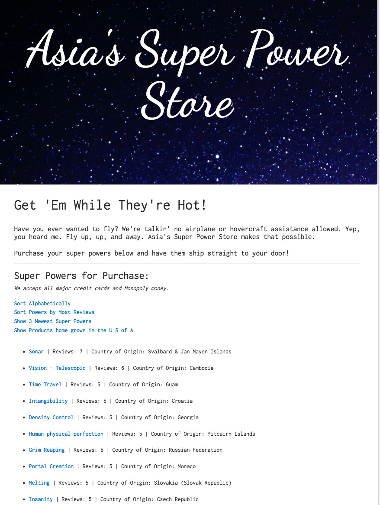

# _Asia's SuperPower Store_

#### _This is a Ruby on Rails application built with Ruby 2.4.1 and Rails 5.1.2.  Purchase your superpowers here!  That's right, you heard me, this is a one stop shop for buying superpowers shipped straight to your door! June 30, 2017_

#### By _**Asia Kane**_

## Description

This is an application to manage the products and reviews for each product at Asia's SuperPower Store. It fulfills the following user stories:

* As a user, I'd like to visit the homepage to see a brief description of the company and list of all products.
* As a user, I'd like to click on a product to visit its detail page including details product name, cost, country of origin, and product reviews.
* As a user, I'd like to be able to create, update, and delete products.
* As a user, I'd like the ability to write a review for a product including author, content, and rating.
* As a user, I'd like the application to ensure all data fields are filled out.
* As a user, I'd like the application to ensure review ratings are on a scale 1-5.
* As a user, I'd like the application to ensure review content is 50-250 characters.
* As a user, I'd like to filter the products by the three most recently added.
* As a user, I'd like to filter the products by the most reviews.
* As a user, I'd like to filter the products by the most reviews.
* As a user, I'd like to filter to see products made in the USA.
* As a user, I'd like to see sample data (50 products, 250 reviews) so that I can better evalute the application.

Additional Features:

* Ability to sort products alphabetically
* App displays average rating on product detail page
* Flash messages for CRUD functionality
* Error messages when creating and updating products and reviews
* Error message when filter returns no results

The application structure is outlined below.  

Models:
  - Products
  - Reviews

## Prerequisites

You will need the following things properly installed on your computer.

* [Git](https://git-scm.com/)
* [Postgres](https://www.postgresql.org/)
* [Ruby 2.4.1](https://www.ruby-lang.org/en/downloads/)
* [Rails 5.1.2](http://rubyonrails.org/)

## Installation

In your terminal:
* `git clone https://github.com/akane0915/superpower-store-rails`
* `cd superpower-store-rails`
* Ensure you are running Ruby 2.4.1 and Rails 5.1.2 versions or later.
* `bundle install`
* Open another terminal window and type `postgres`.  Leave this window open.
* In your first terminal window type:
* `rake db:create`
* `rake db:setup`
* `rake db:test:prepare`

## Development server

Run `rails s` for a dev server. Navigate to `http://localhost:3000/`. The app will automatically reload if you change any of the source files.

* If you would like to make changes to this project, do so in a text editor.
* Make frequent commits with detailed comments.
* Submit changes as pull request to Asia at akane0915 on Github.

## Running unit tests

This app includes unit and integration testing using RSpec, Shouldamatchers, and Capybara for testing.
Run `rspec` in terminal to test.

## Technologies Used

* Ruby
* Rails
* ActiveRecord
* Postgres
* Bundler
* Rake Gem
* Rspec
* HTML
* CSS
* Bootstrap
* ES6

## Known Bugs
_N/A_

## Support and contact details
_I encourage you to update/make suggestions/refactor this code as you see fit. I am always open to improvement! Please contact Asia Kane at asialkane@gmail.com with questions._

### License
*This software is licensed under the MIT license*
Copyright © 2017 **Asia Kane**
